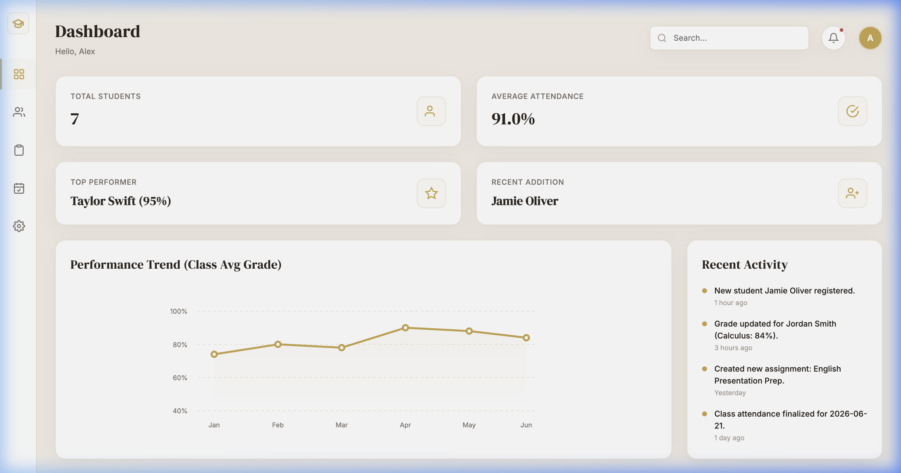
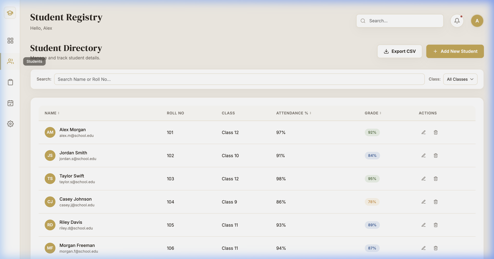
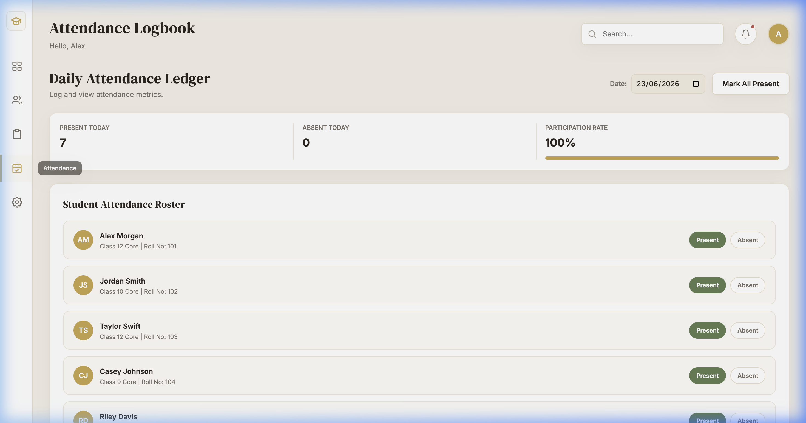
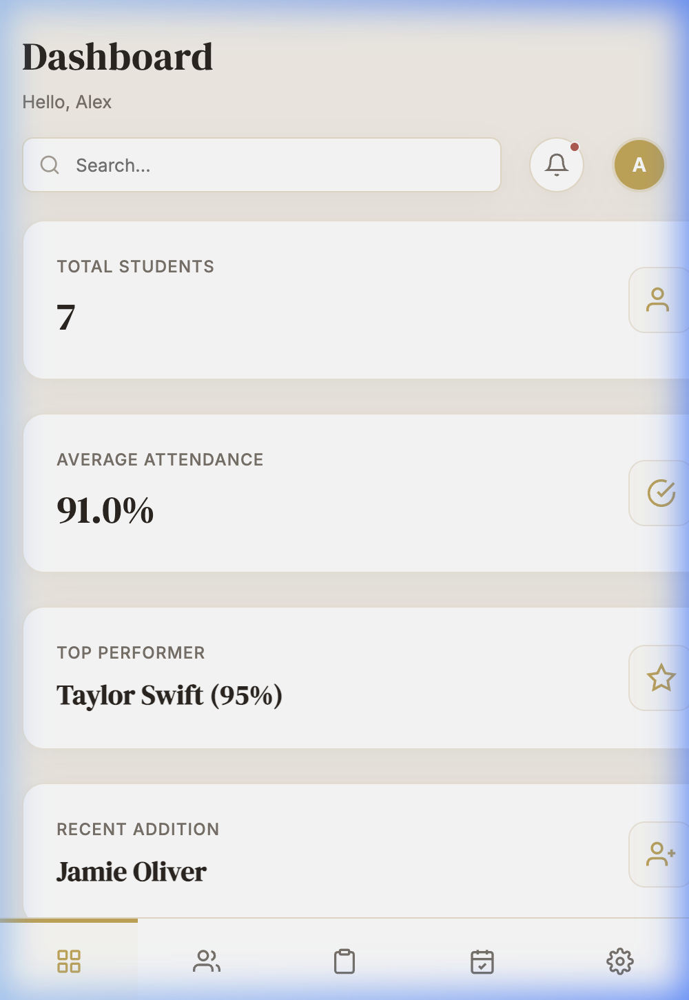

<div align="center">

<br/>

```
███████╗██████╗ ██╗   ██╗████████╗██████╗  █████╗  ██████╗██╗  ██╗
██╔════╝██╔══██╗██║   ██║╚══██╔══╝██╔══██╗██╔══██╗██╔════╝██║ ██╔╝
█████╗  ██║  ██║██║   ██║   ██║   ██████╔╝███████║██║     █████╔╝ 
██╔══╝  ██║  ██║██║   ██║   ██║   ██╔══██╗██╔══██║██║     ██╔═██╗ 
███████╗██████╔╝╚██████╔╝   ██║   ██║  ██║██║  ██║╚██████╗██║  ██╗
╚══════╝╚═════╝  ╚═════╝    ╚═╝   ╚═╝  ╚═╝╚═╝  ╚═╝ ╚═════╝╚═╝  ╚═╝
```

### *A warm, editorial Student Management Dashboard — built to go beyond the brief.*

<br/>


<br/>

**[✦ Live Demo](#)** &nbsp;·&nbsp; **[Report a Bug](#)** &nbsp;·&nbsp; **[Request Feature](#)**

<br/>

</div>

---

## ✦ &nbsp;Overview

EduTrack is a fully client-side Student Management Dashboard built with pure HTML, CSS, and JavaScript — no frameworks, no build tools, no dependencies. It was designed with a warm editorial aesthetic (cream backgrounds, gold accents, DM Serif Display typography) and ships as a zero-setup single-page app that runs by opening a file in the browser.

Originally assigned as a basic CRUD project, it was extended into a full dashboard product with five views, animated charts, attendance tracking, and theme customization — all persisted to `localStorage`.

---

## 🎓 &nbsp;Features

### Core (Assignment Requirements)
| Feature | Description |
|---|---|
| **Add / Edit / Delete** | Full CRUD on student records via modal forms |
| **localStorage** | All data persists across sessions — no backend needed |
| **Styled Table** | Sortable columns, grade badges, hover states |
| **Search & Filter** | Live search by name or roll number + class filter dropdown |

### Beyond the Brief ✦
| Feature | Description |
|---|---|
| **Attendance Tracker** | Per-date roster with present/absent toggle and bulk mark-all |
| **Assignment Manager** | CRUD for assignments with circular SVG progress indicators |
| **Dashboard Analytics** | Animated line chart, stat cards, recent activity feed |
| **Grade Badges** | Color-coded pill badges — green A, blue B, amber C, red D/F |
| **Export CSV** | One-click student data download, pure Blob API, no libraries |
| **Theme Switcher** | Live accent color change via CSS variables, saved to state |
| **Notifications Dropdown** | Animated dropdown with live activity log |
| **Settings Panel** | Persistent admin name, email, and accent color preferences |

---

## 🎨 &nbsp;Design System

```
Background  →  #F5F0E8  (warm cream)
Accent      →  #C9A84C  (editorial gold)
Text        →  #2C2620  (deep ink)
Cards       →  #FFFFFF  (white)
Muted       →  #7A726A  (warm gray)

Display     →  DM Serif Display
Body / UI   →  Inter
```

The palette and type pairing were chosen to match a warm editorial reference — the same feel as a print premium dashboard, not a generic SaaS UI.

---

## 🗂 &nbsp;Project Structure

```
edutrack-dashboard/
├── index.html       ← HTML structure & semantic markup
├── style.css        ← Design tokens, layout, animations
├── script.js        ← App state, CRUD, localStorage, rendering
└── README.md
```

Zero config. No `package.json`. No build step. Open `index.html` and it works.

---

## 🚀 &nbsp;Getting Started

```bash
# Clone the repo
git clone https://github.com/soumi-saha12/edutrack-dashboard

# Enter the folder
cd edutrack-dashboard

# Open in browser — that's it
open index.html
```

Or just **[view the live demo](#)** — deployed on Netlify.

---

## 📱 &nbsp;Responsive Behavior

| Breakpoint | Behavior |
|---|---|
| `> 768px` | Fixed icon sidebar, full data table, 2-col stat grid |
| `≤ 768px` | Bottom tab bar navigation, table becomes student cards, full-screen modals |
| `≤ 480px` | Toast notifications go full-width, export button collapses to icon |

---

## ⌨️ &nbsp;Keyboard Accessibility

- `Escape` — closes any open modal or dropdown
- `Tab` — focus-trapped within open modals
- Auto-focus on first input when modal opens
- Focus returns to trigger button on modal close
- Visible `:focus-visible` rings on all interactive elements

---

## 🛠 &nbsp;Skills Demonstrated

```
✦  CRUD operations with localStorage
✦  Vanilla JS SPA routing (no libraries)
✦  CSS custom properties & design token system
✦  SVG animation (line chart draw, circular progress)
✦  CSS Grid + Flexbox responsive layout
✦  Blob API for CSV file generation
✦  DOM manipulation at scale (3000+ line codebase)
✦  Accessible focus management & keyboard events
✦  Modular app state pattern in plain JS
```

---

## 📸 &nbsp;Screenshots

| | |
|---|---|
|  |  |
|  |  |

---

<div align="center">

<br/>

*Built by* **Soumi Saha** *·  *

<br/>

[](https://github.com/soumi-saha12)
[](https://linkedin.com/in/soumi-saha-523bba318)
[](https://soumi-saha.netlify.app)

<br/>

</div>
